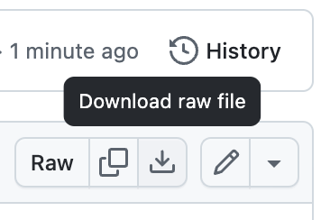
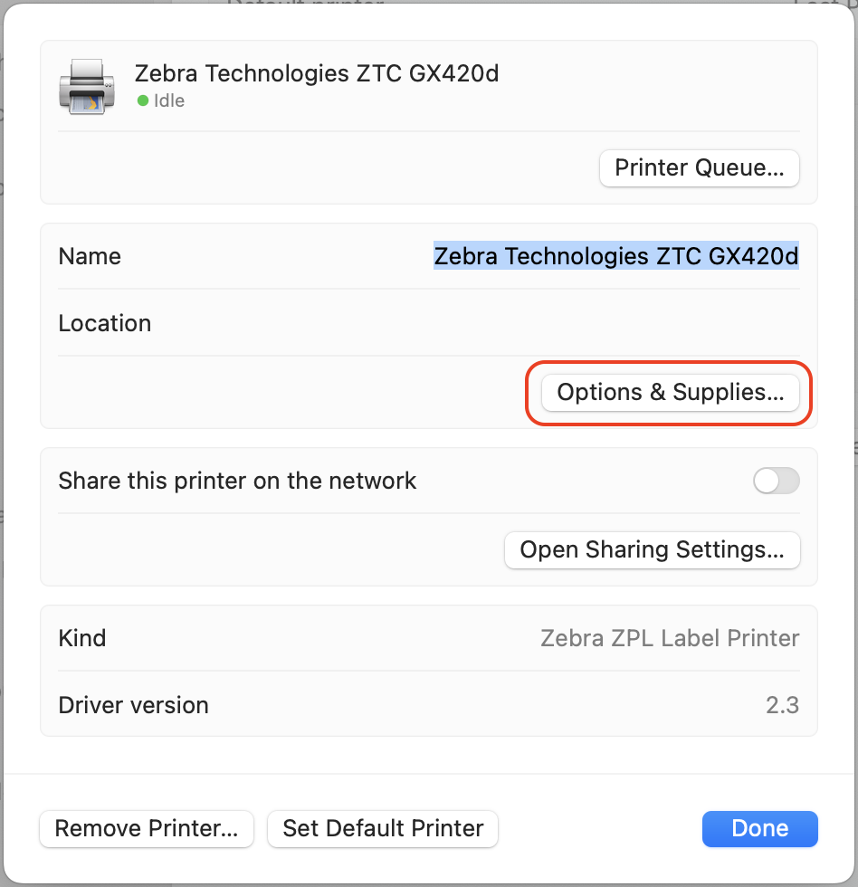
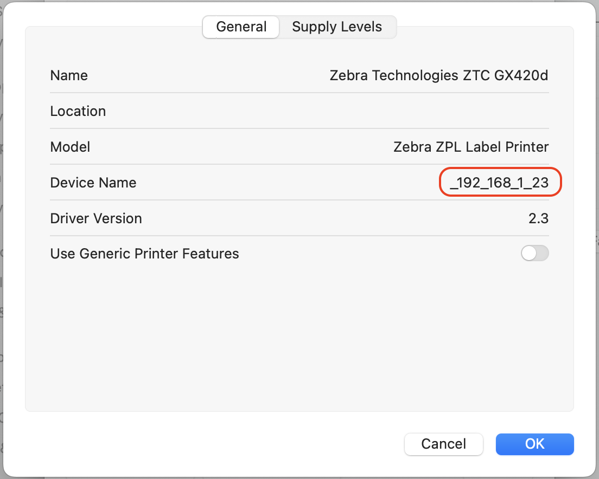
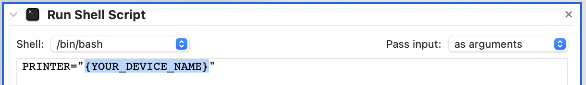

# Zebra Thermal Printer Mac Automator Workflow

## Introduction

Can you get a high quality label out of your Zebra GX420d thermal printer on your Mac without paying for expensive software? Yes!

The Zebra GX420d is very picky about image size and colors that are not black or white. Simply resizing your label or using anti-aliasing will introduce gray colors and result in a blurry print. Your label may even have gray colors to begin with.

I fixed this by creating an Automator workflow that uses Poppler and ImageMagic to remove the gray colors by applying thresholding. The result is a nice crisp label!

In theory, this should work for other Zebra thermal printers, but I have only tested it with my GX420d. If it works (or doesn't work) for the model you have, I would appreciate your feedback so that I can create a list of supported printers and add support if needed. Head over to the [Discussions](https://github.com/john-stephens/zebra-mac-label-automator/discussions) section and let me know.

## Pre-requisites

1. Your Zebra printer has already been set up. See: [Install CUPS Driver for Zebra Printer in Mac OS](https://supportcommunity.zebra.com/s/article/Install-CUPS-driver-for-Zebra-Printer-in-Mac-OS)
2. Poppler and ImageMagick have been installed. It is assumed that these have been installed using [Homebrew](https://brew.sh). (`brew install poppler imagemagick`)

## Installation and Setup

1. Download and unzip `Print Label.workflow.zip`
  - Click `Print Label.workflow.zip` above
  - Click the Download Raw File button

  

2. From Finder browse to `~/Library/PDF Services`

  - Click on the Finder app
  - Click Go > Go to Folder... (⇧ ⌘ G)
  - Enter "~/Library/PDF Services" and press Enter

  

3. Drag `Print Label.workflow` (extension may be hidden) into the `PDF Services` folder.
4. Get the Device Name for your Zebra printer.

  - Go to System Settings > Printers & Scanners
  - Click on your Zebra printer.

  
  
  - Click "Options & Supplies"
  - Copy the "Device Name" value

  

5. Go back to the `PDF Services` folder.
6. Double-click on `Print Label.workflow` to open it in Automator.
7. At the top, replace `{YOUR_DEVICE_NAME}` with the device name you just copied.

  

8. Save the workflow. You are all set!

## Usage

1. Open the label you want to print. (If you need to crop, I recommend opening the label in Preview: click the Markup button, click the selection tool, select the area you want to print, click Tools > Crop (⌘ K))
2. Go to print your label, but don’t actually print. This should be done using the system print dialog.
3. Select your Zebra printer as the printer you want to print from.
4. Set the paper size to label size you are using. (i.e. 4x6in)
5. Make sure the preview matches how you want your label printed.
  
6. From the dropdown on the bottom-left, click "Print Label".
  
