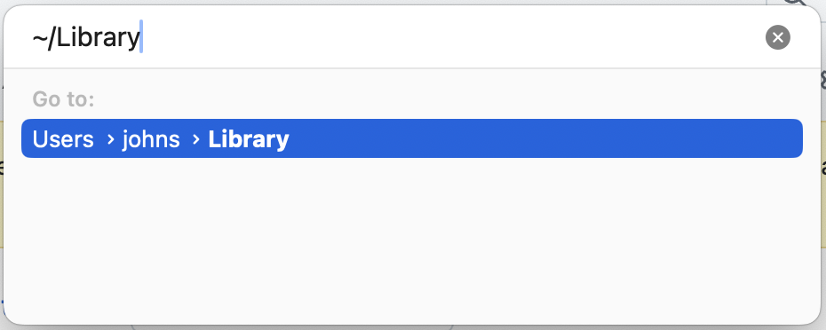
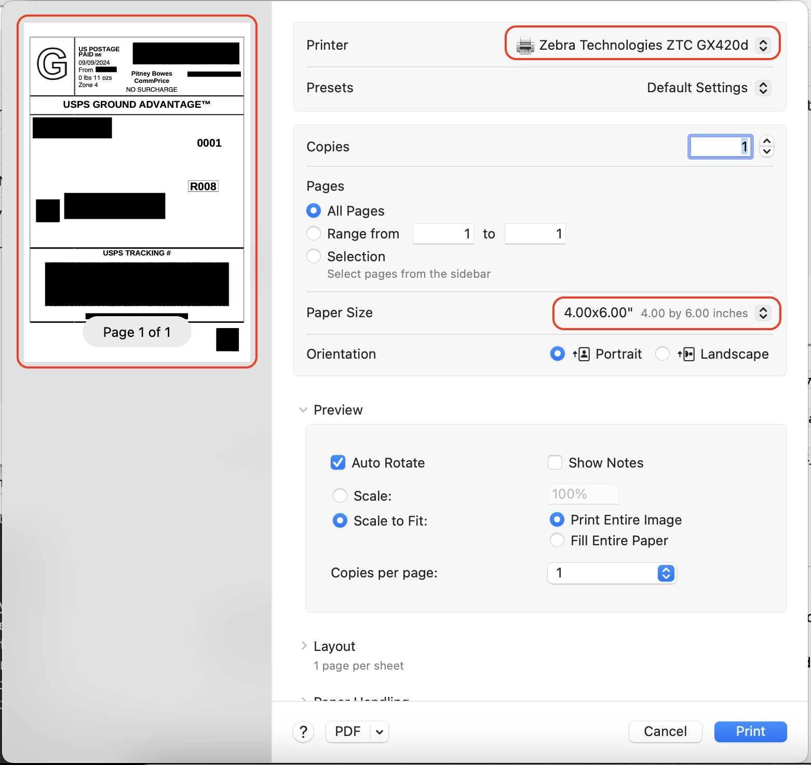
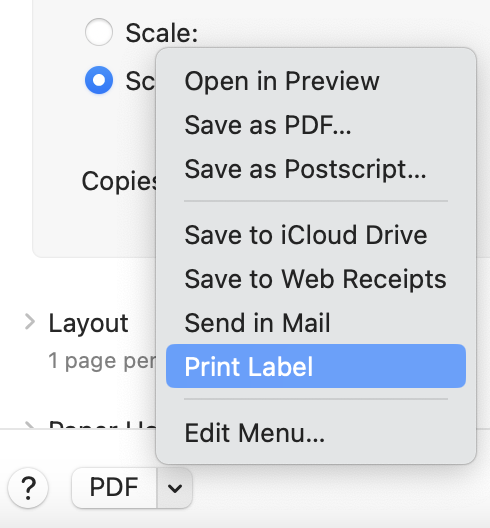
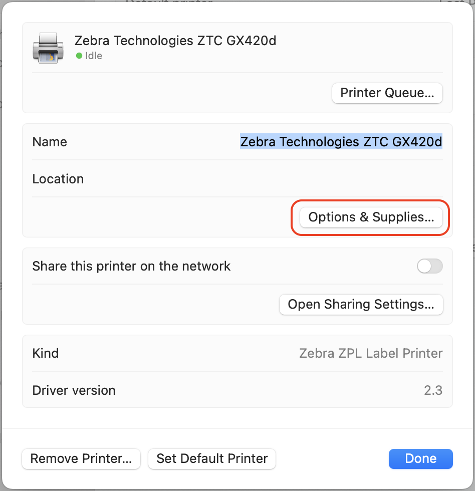
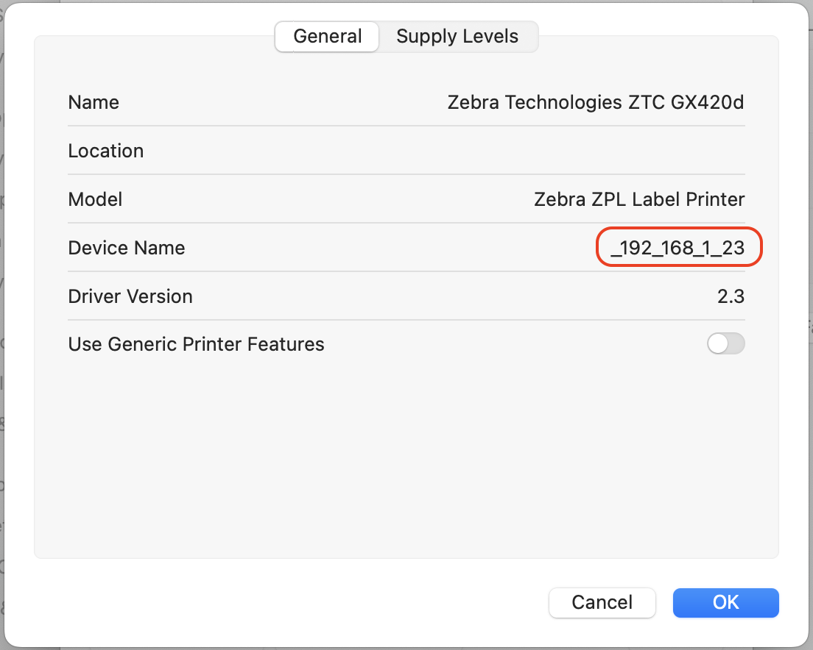
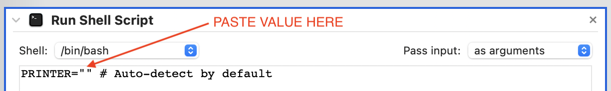
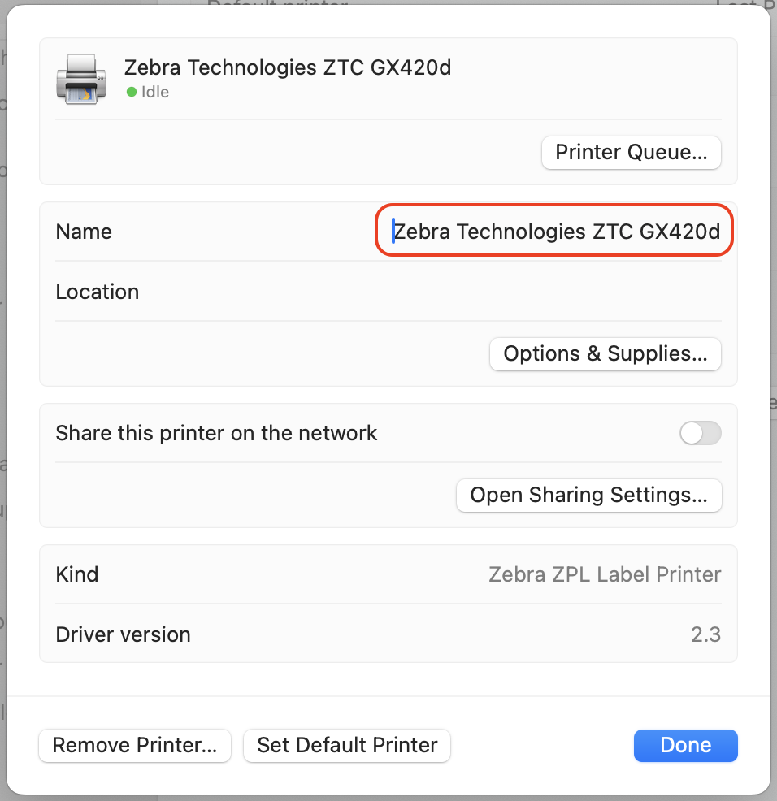

# Zebra Thermal Printer Mac Automator Workflow

## Introduction

Can you get a high quality label out of your Zebra thermal printer on your Mac without paying for expensive software? Yes!

The Zebra printer is very picky about image size and colors that are not black or white. Simply resizing your label or using anti-aliasing will introduce gray colors and result in a blurry print. Your label may even have gray colors to begin with.

I fixed this by creating an Automator workflow that uses Poppler and ImageMagic to remove the gray colors by applying thresholding. The result is a nice crisp label!

## Tested Printers

- GK420d
- GX420d
- LP2844
- ZD230
- ZD420
- ZD621D
- ZT410

If it works (or doesn't work) for the model you have, I would appreciate your feedback so that I can fill in the list of tested printers and add support if needed. Head over to the [Discussions](https://github.com/john-stephens/zebra-mac-label-automator/discussions) section and let me know.

## Pre-requisites

1. Your Zebra printer has already been set up. See: [Install CUPS Driver for Zebra Printer in Mac OS](https://supportcommunity.zebra.com/s/article/Install-CUPS-driver-for-Zebra-Printer-in-Mac-OS)
2. Poppler, ImageMagick, and Ghostscript have been installed. It is assumed that these have been installed using [Homebrew](https://brew.sh). (`brew install poppler imagemagick ghostscript`)

## Installation and Setup

1. Download and unzip [Print Label.workflow.zip](//github.com/john-stephens/zebra-mac-label-automator/releases/latest/download/Print.Label.workflow.zip)
2. From Finder browse to `~/Library`

  - Click on the Finder app
  - Click Go > Go to Folder... (⇧ ⌘ G)
  - Enter "~/Library" and press Enter

  

3. Create a folder named `PDF Services` if it does not already exist 
4. Drag `Print Label.workflow` (extension may be hidden) into the `PDF Services` folder. You are all set!

## Usage

### General

1. Open the label you want to print.
2. Go to print your label, but don’t actually print. This should be done using the system print dialog. (See the sections below about [Chrome](#chrome) and [Firefox](#firefox).)
3. Select your Zebra printer as the printer you want to print from.
4. Set the paper size to the label size you are using. (i.e. 4x6in)
5. Make sure the preview matches how you want your label printed.

  

6. From the dropdown on the bottom-left, click "Print Label".

  

> [!NOTE]
> Printing more than 1 copy at a time is not supported. This is because MacOS does not pass through the number of copies to Automator.

> [!TIP]
> If you need to crop, I recommend opening the label in Preview: click the Markup button, click the selection tool, select the area you want to print, click Tools > Crop (⌘ K)

### Chrome

Chrome has its own print dialog which does not make the Automation workflows available. While Chrome does have a "Print using System Dialog" option, there is no preview and it occasionally does not trigger the Automation workflows when selected.

1. Start the process to print your label.
2. Select your Zebra printer as the printer you want to print from.
3. Set the paper size to the label size you are using. (i.e. 4x6in)
4. Click "Open in Preview" option from the print dialog.
5. Follow the [General](#general) process above.

### Firefox

Firefox has its own print dialog which does not make the Automation workflows available. You will need to use the "Print using the system dialog..." option in order to use the Automation workflow.

1. Start the process to print your label.
2. Select your Zebra printer as the printer you want to print from.
3. Set the paper size to the label size you are using. (i.e. 4x6in)
4. Click "Print using the system dialog..." option from the print dialog.
5. Follow the [General](#general) process above.

## Troubleshooting

### Error: "Failed to auto-detect your Zebra printer."

The workflow is trying to find a printer name that starts with "Zebra" and doesn't find it. There could be two reasons for this:

1. The driver for your Zebra printer is not installed. See: [Install CUPS Driver for Zebra Printer in Mac OS](https://supportcommunity.zebra.com/s/article/Install-CUPS-driver-for-Zebra-Printer-in-Mac-OS)
2. The name of your Zebra printer does not start with "Zebra". You have two options here:

  a. Rename your Zebra printer so that it starts with "Zebra". See [Renaming your printer](#renaming-your-printer).
  
  b. Set the `PRINTER` value in the workflow with your Zebra printer's device name. See [Editing the `PRINTER` value](#editing-the-printer-value).

### The workflow prints to the wrong Zebra printer

The workflow is trying to find a printer name that starts with "Zebra" and it is picking the wrong one because there are multiple. You have a few options in this case:

a. Rename the other printer so that the one you want to print to is the only one with a name that starts with "Zebra". See [Renaming your printer](#renaming-your-printer).

b. If only one device you want to print to, set the `PRINTER` value in the workflow with that Zebra printer's device name. See [Editing the `PRINTER` value](#editing-the-printer-value).

c. If you want to print to multiple Zebra printers, make a copy of `Print Label.workflow`, one for each printer, and set the `PRINTER` value for each copy with the corresponding Zebra printer's device name. Make sure that you set the workflow to an appropriate filename so that you know which workflow corresponds to which printer. See [Editing the `PRINTER` value](#editing-the-printer-value).

### Error: "Printer "{YOUR-PRINTER-NAME}" not found."

The `PRINTER` value at the top of the workflow was not set to the correct printer device name. Make sure that you have the correct device name value. See [Getting the device name for your printer](#getting-the-device-name-for-your-printer) and [Editing the `PRINTER` value](#editing-the-printer-value).

### Error: "Failed to determine the printer DPI!"

The workflow tried to read the printer options and didn't find a matching "Resolution" option. If this happens, I would appreciate feedback. Drop a comment in the [Discussions](https://github.com/john-stephens/zebra-mac-label-automator/discussions) section with the output of `lpstat -p | awk '{print $2}' | xargs -t -n1 -I {} lpoptions -p {} -l`.

### Error: "Failed to determine the printer media!"

The workflow tried to determine the appropriate media value based on the page size, but couldn't find a match for your printer. If this happens, I would appreciate feedback. Drop a comment in the [Discussions](https://github.com/john-stephens/zebra-mac-label-automator/discussions) section with the output of `lpstat -p | awk '{print $2}' | xargs -t -n1 -I {} lpoptions -p {} -l
`.

### Error: ""identify" not found" or ""magick" not found"

This will happen if `identify` or `magick` are not found. This could either be because ImageMagick is not installed or was not installed with [Homebrew](https://brew.sh). You have two options in this case:

a. Install ImageMagick with [Homebrew](https://brew.sh).

b. Correct the path for `identify` or `magick` at the top of `Print Label.workflow`.

### Error: ""pdftoppm" not found" or ""pdfinfo" not found"

This will happen if `pdftoppm` or `pdfinfo` are not found. This could either be because Poppler is not installed or was not installed with [Homebrew](https://brew.sh). You have two options in this case:

a. Install Poppler with [Homebrew](https://brew.sh).

b. Correct the path for `pdftoppm` or `pdfinfo` at the top of `Print Label.workflow`.

## Reference

### Getting the device name for your printer

1. Go to System Settings > Printers & Scanners
2. Click on your Zebra printer.

  
  
3. Click "Options & Supplies"
4. Copy the "Device Name" value

  
  
### Editing the `PRINTER` value

1. Browse to the `PDF Services` folder.

  - Click on the Finder app
  - Click Go > Go to Folder... (⇧ ⌘ G)
  - Enter "~/Library/PDF Services" and press Enter

2. Double-click on `Print Label.workflow` (extension may be hidden) to open it in Automator.
4. At the top, fill in your device name as the value for `PRINTER`. See [Getting the device name for your printer](#getting-the-device-name-for-your-printer).

  

5. Save the workflow.

### Renaming your printer

  - Go to System Settings > Printers & Scanners
  - Click on your printer.
  - Change the name of your printer by typing in the "Name" field.
  - Click "Done"

  
